# Mustafa Ahmed

<p align="center">
  <strong>AI Systems Architect · Automation Engineer · Execution-First Product Builder</strong>
</p>

<p align="center">
  I design and ship AI-enabled systems, automation infrastructure, developer tooling, and intelligent products — from problem definition to deployable implementation.
</p>

<p align="center">
  <a href="https://github.com/MustafaAhmed007">GitHub</a> ·
  <a href="mailto:engrmustafa0007@gmail.com">Email</a>
</p>

<p align="center">
  
  
</p>

<p align="center">
  <strong>OPEN TO SELECTED OPPORTUNITIES</strong><br>
  AI Engineering · AI Systems · Automation · Product Engineering · Developer Tools
</p>

---

<!-- PROFILE-AUTO-GENERATED:START -->

<table>
<tr>
<td width="54%" valign="top"></td>
<td width="46%" valign="top"></td>
</tr>
</table>

<p align="center"></p>

<!-- PROFILE-AUTO-GENERATED:END -->

## What This Repository Is

A **configuration-driven Developer Command Center** that generates the visual modules used in this profile.

```text
config.py
   ↓
validated profile + design tokens
   ↓
Python generator
   ↓
SVG identity / information / activity modules
   ↓
README presentation
```

The repository is designed to be **reproducible, testable, maintainable, and easy to customize**.

## What I Build

```text
AI SYSTEMS        AI-enabled workflows, agents, orchestration and product architectures
AUTOMATION        Repeatable pipelines that remove manual execution and operational friction
PRODUCTS          Useful software from requirements → implementation → deployment
DEV TOOLING       Systems that improve how developers build, present and maintain software
DATA WORKFLOWS    Structured, measurable workflows for analysis and decision support
```

My operating loop:

```text
Problem → System → Automation → Product → Measurable outcome
```

## Evidence Standard

Claims belong behind inspectable evidence. Public systems are linked when their implementation, artifact, demo, benchmark, case study, or equivalent proof is actually available.

| System | Demonstrates | Evidence |
|---|---|---|
| **Developer Command Center** | Deterministic profile generation, reusable SVG modules, structured configuration | This repository |
| **AI Systems & Automation** | AI-assisted execution and workflow orchestration | Added as public implementations ship |
| **Developer Tooling** | Automation of repeated engineering workflows | Added as public implementations ship |

## Engineering Principles

```text
SYSTEM-FIRST       Build the operating system, not a one-off artifact.
EVIDENCE-FIRST      Show implementation before making the claim.
AUTOMATION-FIRST    Automate repeated work once the workflow is understood.
OUTCOME-FIRST       Optimize for shipped results, not activity.
ITERATIVE           Convert feedback into reusable system components.
```

## Reproduce Locally

Requirements: Python 3.10+.

```bash
git clone https://github.com/MustafaAhmed007/MustafaAhmed007.git
cd MustafaAhmed007
python -m venv .venv
# Windows: .venv\Scripts\activate
# macOS/Linux: source .venv/bin/activate
python -m pip install -r requirements.txt
python -m pip install pytest
python generator.py
python generator.py --validate
pytest -q
```

### Customize

Use `config.py` as the source of truth for profile content, themes, design tokens, contribution data, and public proof-of-work entries. `config.example.py` is the portable template for adapting the system to another profile.

## Quality & Safety

The repository ships with a GitHub Actions quality gate covering Python 3.10–3.13, compilation, tests, and SVG validation. Python dependencies are declared in `requirements.txt` and project metadata lives in `pyproject.toml`.

Security reporting guidance is available in [`SECURITY.md`](SECURITY.md), and development/contribution rules are documented in [`CONTRIBUTING.md`](CONTRIBUTING.md).

## Monetizable Product Direction

The underlying architecture is reusable beyond this profile. It can be packaged as a **custom developer-profile/command-center service** with configuration, brand system, proof-of-work sections, automated generation, validation, and GitHub-ready output.

The product loop is:

```text
Client input → configuration → generation → QA → delivery → feedback → template improvement
```

## Feedback Loop

```text
Visitor / recruiter / client feedback
                ↓
         Identify friction
                ↓
      Improve evidence or UX
                ↓
            Regenerate
                ↓
          Validate + inspect
                ↓
             Repeat
```

## Open to Opportunities

I am open to selective opportunities where I can build and ship high-leverage technical systems.

**Strong fit:** AI engineering · AI systems · automation engineering · intelligent product engineering · developer tooling · technical systems architecture.

**Engagements:** full-time · contract · consulting · high-leverage collaborations

📩 **engrmustafa0007@gmail.com**

---

<p align="center">
  <sub>Built as a deterministic, configurable developer command center.</sub>
</p>
